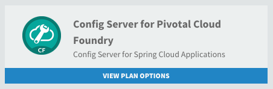
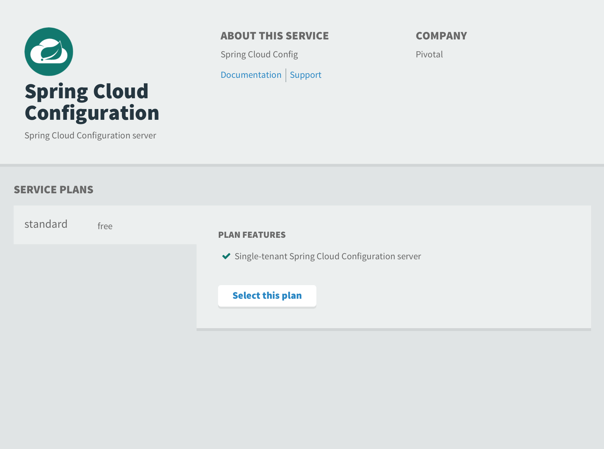
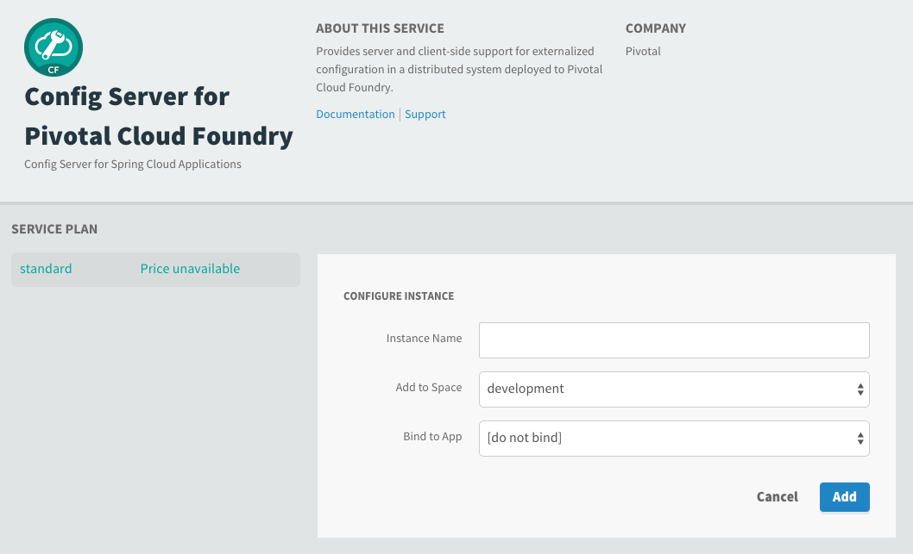
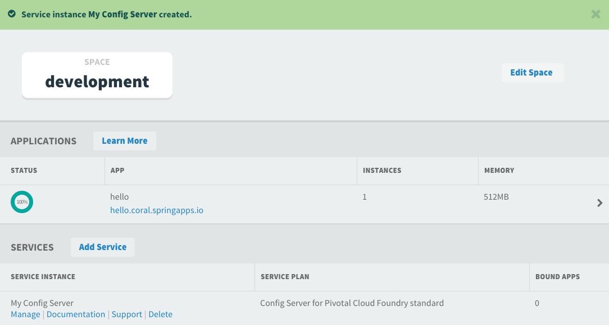
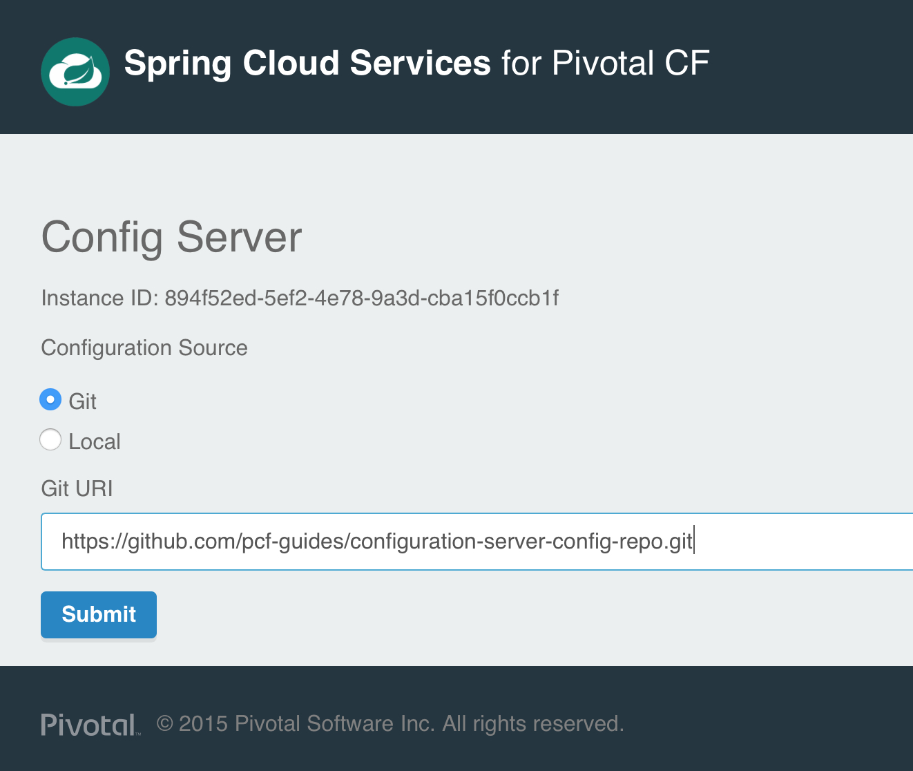
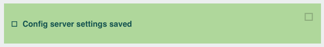

:toc:
:project_id: gs-configuration-server
:icons: font
:source-highlighter: prettify

This guide walks you through the process of creating a "hello world" Configuration Server and client service.

== What you'll build

You will enable support for Spring Cloud Config Server and build a client app that will read configuration properties from the server.

== What you'll need

include::https://raw.githubusercontent.com/spring-guides/getting-started-macros/master/prereq_editor_jdk_buildtools.adoc[]

include::https://raw.githubusercontent.com/spring-guides/getting-started-macros/master/how_to_complete_this_guide.adoc[]

include::https://raw.githubusercontent.com/spring-guides/getting-started-macros/master/hide-show-gradle.adoc[]

include::https://raw.githubusercontent.com/spring-guides/getting-started-macros/master/hide-show-maven.adoc[]

include::https://raw.githubusercontent.com/spring-guides/getting-started-macros/master/hide-show-sts.adoc[]

[[initial]]
== Configure the Spring Cloud Configuration server

The Pivotal Cloud Foundry Marketplace offers the Spring Cloud Configuration server as a service for providing externalized configuration for your various applications and services running on PCF.

. Select the "Spring Cloud Configuration Service" from the Marketplace:
+

. Select the desired plan for the new service:
+

. Provide a name for the new Config Server service and click the "Add" button:
+

. The new service is created and available for use:
+

. Select the "Manage" link on the new service instance and enter the following URI for the configuration Git repo:
+
  https://github.com/pcf-guides/configuration-server-config-repo.git
+
A Git repo is the recommended configuration source.
+

. The green confirmation box indicates the service is configured:
+

You have completed the setup for a Spring Cloud Configuration service. This service can now be used to provide centralized configuration to a client application running on Cloud Foundry.

== Utilize the configuration in a client app

TODO

== Summary

Congratulations! You've just enabled centralized configuration and utilized that configuration from within a client application.
